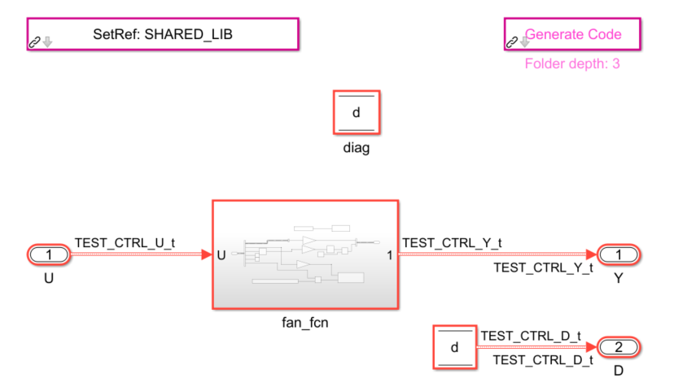
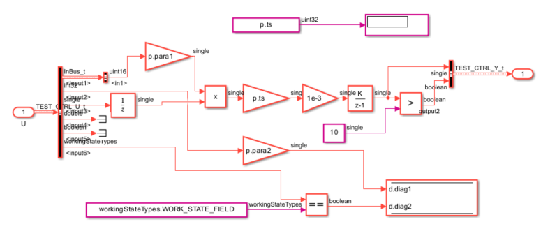

Demonstration of Ctypesgen with DLL generated from Matlab/Simulink
========================================================================

Demonstration of using the simulink library (DLL) in python.
The library was generated with 'ert_shrlib.tlc' target.
Original Matlab files are not shared, but a screenshot from the block diagram.
Simulink data types are defined in additional header file 'rtwtypes.h'
For generated source code see 'test_ctrl.c' and 'test_ctrl.h'
'ert_main.c' is generated as an example integration code

see modification of 'printer.py' too

## Model root:



## Model subsystem:



Steps:
----------
1. (Re)Generate the bindings (or you can just try the bindings that were
    already generated and saved in this directory)

    `python.exe ./demo/SimulinkDLL/generate_bindings.py`

2. Run the app that uses these newly generated bindings

    `python.exe ./demo/SimulinkDLL/main.py`

    The results of this execution should give

    ```
    time = 0.00 s; output1 = 0.00; output2 = 0; diag1 = 6.0; diag2 = 0
    time = 0.20 s; output1 = 0.00; output2 = 0; diag1 = 6.0; diag2 = 0
    time = 0.40 s; output1 = 1.00; output2 = 0; diag1 = 12.0; diag2 = 1
    time = 0.60 s; output1 = 2.00; output2 = 0; diag1 = 12.0; diag2 = 1
    time = 0.80 s; output1 = 3.00; output2 = 0; diag1 = 12.0; diag2 = 1
    ```
